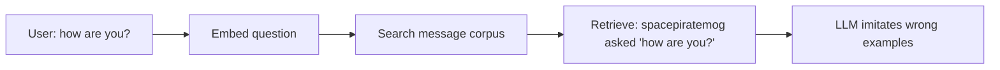

# Improving spacepiratemog Voice Quality

## Diagnosis: why RAG feels broken today

Your current pipeline embeds **isolated outgoing messages** ([`loaders/discord_chat.py`](loaders/discord_chat.py) keeps only `spacepiratemog` lines) and retrieves by **cosine similarity to the user's question** ([`chat.py`](chat.py) `similarity_search` / MMR on the raw question).



Embeddings match **surface text**, not **conversational role**. Questions retrieve questions; statements retrieve statements. This is expected behavior for the current schema — not a bug in Chroma or Ollama.

Your raw exports **already contain the missing context**. Example from [`data/discord/m4yb31dr4gon.txt`](data/discord/m4yb31dr4gon.txt):

```text
m4yb31m4dr4g0n — ... Are you going to b-day party tomorrow?
spacepiratemog — ... Adrian's?
```

The loader discards the first line, so the reply `"Adrian's?"` is stored with no prompt context and can never be retrieved correctly for party-planning questions.

---

## 1. Is RAG the right approach?

**Short answer:** RAG alone is a weak fit for *voice modeling*, but a **restructured RAG** (conversation-pair retrieval) is the right **first** step for your setup. Full model training is optional phase 2.

| Approach | Best for | Fit for your goal |
|---|---|---|
| **Current RAG** (solo messages) | Fact lookup, quoting past statements | Poor — retrieves wrong message type |
| **Pair-based RAG** (prompt → reply) | Dialogue style, "how would they respond?" | Good — fixes your main complaint with existing data |
| **Few-shot prompt** (static curated examples) | Small corpus, quick wins | Good supplement; 204 msgs is small enough to sample manually |
| **LoRA fine-tune** (local qwen2.5:7b) | Deep voice/style internalization | Best long-term voice, but needs **500–2000+ quality pairs** and GPU time |
| **Full training** | Large proprietary datasets | Overkill; not recommended |

**Recommendation:** **Hybrid path, RAG first**

1. **Now:** Restructure data into `(incoming context) → (spacepiratemog reply)` pairs; retrieve on incoming context.
2. **Next:** Add data cleaning + more Discord exports parsed the same way.
3. **Later (if still unsatisfied):** LoRA fine-tune on pair dataset; keep RAG optional for factual recall.

Fine-tuning a 7B model on ~204 solo messages would overfit and likely still miss conversational behavior. Pair extraction from full exports (which you already have) matters more than raw message count.

---

## 2. Prioritizing your ideas

### High priority (do these)

**A. Build conversation pairs from full Discord exports (most important)**

- Extend [`loaders/discord_chat.py`](loaders/discord_chat.py) with a second parser that reads **all authors** and emits documents like:

```text
[incoming]
m4yb31m4dr4g0n: Are you going to b-day party tomorrow?

[reply]
Adrian's?
```

- **Embed the incoming side** (or the full pair with metadata separating prompt vs reply).
- At query time: embed the user's message, retrieve top-k **pairs**, pass pairs to the LLM as "when someone said X, spacepiratemog replied Y."
- Handle multi-message incoming blocks (merge consecutive non-target messages before a spacepiratemog reply).
- Handle spacepiratemog initiating conversation (no incoming): tag as `type: unprompted` and exclude from question-answer retrieval or use a separate retrieval path.

This directly fixes "how are you" retrieving spacepiratemog asking "how are you."

**B. Remove links, embeds, and low-signal content**

- Strip URLs, `Image`, YouTube/Teleparty embed boilerplate, bare `👍`-only replies from embedding (or downrank them).
- Cheap win; reduces clutter like the Spiritfarer trailer block in your sample data polluting retrieval.

**C. Ingest more full Discord exports (with other users visible)**

- Your larger Discord body is **high value if parsed as pairs**, not as solo messages.
- Exports that hide other users' messages are **low value** for dialogue modeling (same problem you have now).

### Medium priority (helpful, not first)

**D. Static style profile in the system prompt**

- Automatically compute from corpus: median message length, emoji frequency, common openers, formality level.
- Inject as explicit rules in [`chat.py`](chat.py) prompt (more reliable than hoping retrieval conveys style).

**E. Rebuild Chroma cleanly**

- Delete `data/chroma/` and re-embed after pair restructuring (you may still have duplicate entries from the earlier 612-embedding run).

### Low priority (defer)

**F. Sentiment analysis on other users' messages**

- Marginal gain over including their raw (or lightly summarized) text in the incoming block.
- Adds pipeline complexity and another model step.
- If incoming messages are long, a one-line **LLM summary** of the prompt is more useful than per-message sentiment scores.

**G. Facebook posts (metadata only)**

- Poor fit for Discord chat persona; different medium, little text signal.
- Skip unless you later want a separate "social post" mode.

---

## 3. Approaches you may be missing

**Intent-based retrieval (optional upgrade after pairs)**

- Bucket pairs by intent: greeting, scheduling, banter, support, etc.
- Retrieve within the best-matching bucket instead of pure embedding similarity.
- Helps when phrasing differs but situation is similar.

**Retrieve pairs, generate reply separately**

- Don't ask the LLM to "be spacepiratemog using these random messages."
- Ask: "Given these examples of how spacepiratemog replied to similar messages, write the next reply."
- Clearer task = less assistant-y drift.

**Evaluation script before/after**

- Fixed test prompts: `"how are you"`, `"who are you"`, `"want to watch something?"`, `"who is Lily?"`.
- Log retrieved pairs + output with `SHOW_SOURCES=true`.
- Objective way to tell if changes help.

**LoRA fine-tune (phase 2)**

- After pair extraction from all available exports, format as instruction data:
  - `{"input": "<incoming context>", "output": "<spacepiratemog reply>"}`
- Tools: `unsloth` / `llama.cpp` fine-tune / Ollama modelfile with few-shot (limited).
- Target: 500+ pairs minimum; 1000+ ideal for noticeable style lock-in on 7B.

---

## Recommended implementation phases

### Phase 1 — Fix retrieval schema (biggest bang, no new data sources)

Changes to [`loaders/discord_chat.py`](loaders/discord_chat.py):

- Add `parse_discord_conversation_pairs()` that walks full export chronologically.
- For each `spacepiratemog` message, attach preceding non-target message(s) as `incoming`.
- Store `page_content` for embedding as incoming text; store reply in metadata or as structured two-part content.
- Filter out link/image-only replies.

Changes to [`main.py`](main.py):

- Embed pair documents instead of (or in addition to) solo messages.
- Rebuild vector store.

Changes to [`chat.py`](chat.py):

- Update `format_docs()` to show pairs: `"When someone said: ..." / "spacepiratemog replied: ..."`.
- Tune prompt to imitate **reply behavior**, not general message style.
- Lower `TOP_K` to 3 once pairs carry more context each.

### Phase 2 — Data expansion and cleaning

- Ingest larger Discord export set through pair parser.
- Add content filters (URLs, embeds, `<N` char replies).
- Add `preview_pairs.py` script (like existing `preview_discord.py`) to inspect pair quality.

### Phase 3 — Evaluate; decide on fine-tuning

- Run eval script on 10–15 fixed prompts.
- If voice is still too generic: LoRA fine-tune on pair JSON with local qwen2.5:7b.
- Keep pair-RAG at inference time for grounding; fine-tune handles tone.

---

## Expected outcome after Phase 1

| User asks | Before | After |
|---|---|---|
| "how are you?" | Retrieves times spacepiratemog *asked* "how are you?" | Retrieves pairs where someone greeted/check-in'd and spacepiratemog *responded* |
| "want to watch hazbin hotel?" | Random similar phrases | Retrieves `"Wanna watch hazbin hotel together"` exchange pattern |
| "who is Tess?" | Hallucination (name not in corpus) | Still "I don't know" — but honestly, without inventing |

Voice will improve because the LLM sees **response examples in context**, not unrelated solo messages. It won't be perfect on 204 pairs, but the failure mode shifts from "wrong message type" to "not enough similar examples" — which is fixable with more exports.
